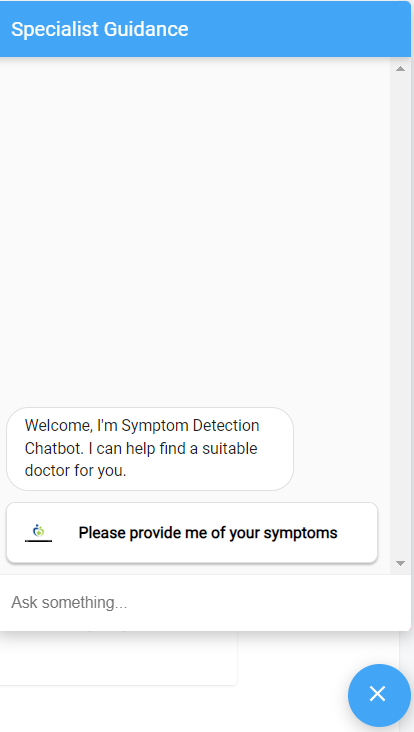
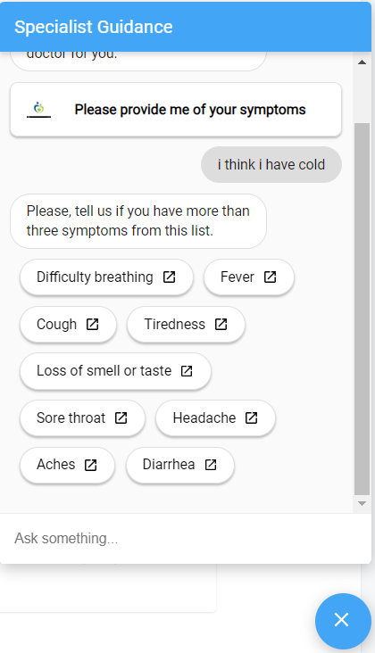
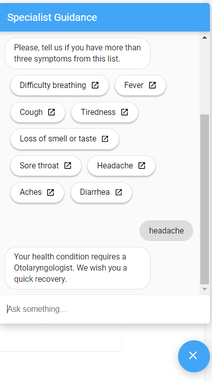

# Medical Assistant

 An **AI-powered healthcare Chatbot** that helps patients find suitable doctors based on symptoms, location. It uses python trained model.

## Main Features

- Symptom Detection Module
- User Authentication(sign-up,sign-in)

## Tech Stack Used

- Symptom Detection Module: **Python**, **Flask**
- Real-time Reporting Dashboard: **Node.js**, **Express.js**,**React.js**, **MongoDB**


## ScreenShots

#### Authentication 

## 


#### DashBoard

## 


#### Symptoms Detection Chatbot

## 

## 

## 

#### Python Terminal Chatbot

## 

## 


## Run on your Device

#### Prerequisites
You may find below the list of things you need to use this project :

Make Sure Python downloaded.
Make sure MongoDB is running on your system.
You will need to install the "npm" command line.


Clone the project from the repository
```bash
  git clone https://github.com/vaibhavi-singh-673/chatbot.git
  cd chatbot
```

Install dependencies

Start the python
```bash
  cd Python-Train-Model
  python -m venv venv
  venv\Scripts\activate
```
```bash
  pip install -r requirements.txt
  python chat_bot.py
```

Start the server
```bash
  cd web-app
  cd server/
  npm install --force
  npm run server
```

Start the Client
```bash
  cd web-app 
  cd react-app/
  npm install --force
  npm run start
```


- Made by [@vaibhavi-singh-673](https://github.com/vaibhavi-singh-673)
